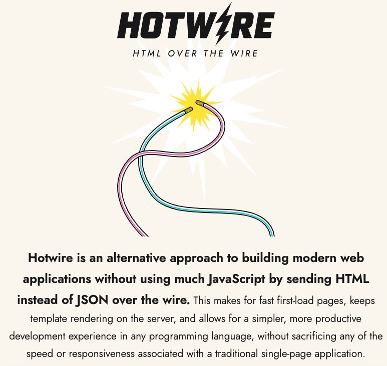

# README

Hotwire is the default frontend solution shipped in Rails. It's a set of tools that allow you to build modern web applications without using much JavaScript.

It is a frontend solution, and it can work with any backend framework.

This repository contains useful resources to help you use Hotwire in your Python web projects.

## Django

### Helpers

* [django-turbo-helper](https://github.com/rails-inspire-django/django-turbo-helper) Hotwire/Turbo helpers for Django
* [django-actioncable](https://github.com/rails-inspire-django/django-actioncable) This package provides Rails Action Cable support to Django Channels.
* [django-viewcomponent](https://github.com/rails-inspire-django/django-viewcomponent) Build reusable components in Django, inspired by Rails ViewComponent
* [django-lookbook](https://github.com/rails-inspire-django/django-lookbook) Empower your Django development with this pluggable app for creating a robust component library

### Projects

* [chatgpt-django-project](https://github.com/rails-inspire-django/chatgpt-django-project) ChatGPT Demo Built with Django, Hotwire, Celery
* [wagtail](https://github.com/wagtail/wagtail) Wagtail CMS use Stimulus as frontend solution of the Wagtail admin interface.
* [viewflow](https://github.com/viewflow/viewflow) This package use Turbo as frontend solution.
* [builtwithdjango](https://github.com/builtwithdjango/builtwithdjango) Use Stimulus as frontend solution
* [DocHub-ULB/DocHub](https://github.com/DocHub-ULB/DocHub) Use Hotwire without frontend build process.
* [Princeton-CDH/geniza](https://github.com/Princeton-CDH/geniza) Use Hotwire as frontend solution.

### Learning Resources

* [Tutorial Series: How to create ChatGPT-alike interface with Hotwire, Django and Celery](https://saashammer.com/blog/creating-chatgpt-interface-with-hotwire-django-celery/)
* [Hotwire Django Tutorials](https://tutorial.saashammer.com/) This free tutorial series will help you learn how to use Hotwire in Django, very suitable for beginners.
* [ebook: The Definitive Guide to Hotwire and Django](https://leanpub.com/hotwire-django)

### Blog Posts

* [Reusable Components in Django with Stimulus and Tailwind CSS - Part 1](https://testdriven.io/blog/django-reusable-components-part-1/)
* [Reusable Components in Django with Stimulus and Tailwind CSS - Part 2](https://testdriven.io/blog/django-reusable-components-part-2/)

## Flask

### Helpers

* [turbo-flask](https://github.com/miguelgrinberg/turbo-flask) Integration of Hotwire's Turbo library with Flask.

### Projects

* [https://github.com/google/osv.dev](https://github.com/google/osv.dev) This package use Turbo as frontend solution.
* [https://github.com/GoogleCloudPlatform/contact-center-ai-samples](https://github.com/GoogleCloudPlatform/contact-center-ai-samples)

### Learning Resources

* [Dynamically Update Your Flask Web Pages Using Turbo-Flask](https://blog.miguelgrinberg.com/post/dynamically-update-your-flask-web-pages-using-turbo-flask)
* [Using Turbo-Flask to Stream Progress Updates to Users Without (More) JavaScript](https://world.hey.com/georgespencer/using-turbo-flask-to-stream-progress-updates-to-users-without-more-javascript-81479750)
* [Building two sample apps using Hotwire and Flask](https://eduardovra.github.io/building-two-sample-apps-using-hotwire-and-flask/)

## Pyramid

### Projects

* [https://github.com/pypi/warehouse](https://github.com/pypi/warehouse) pypi.org is using Stimulus as frontend solution
